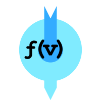

<div align="center">



# Formulavize

**Visual workflows from code.**

Write `fiz` recipes, compile them into DAGs, and see them drawn instantly.

[](http://commitizen.github.io/cz-cli/)
[](LICENSE)

</div>

## What is Formulavize?

Formulavize is a visual editor for **fiz**, a small, functionally inspired
language for describing directed acyclic graphs. You write a recipe in the editor
on the left; it is parsed, compiled into a DAG, and redrawn as an interactive
graph on the right — live, as you type.

Every call becomes a node and its arguments become the nodes upstream of it, so a
pipeline reads the way it runs. Styling, namespaces, and imports are part of the
language rather than the UI, which means a recipe is a complete, portable
description of both the graph and how it should look.

The language itself lives in two sibling packages: **lezer-fiz** (the
[Lezer](https://lezer.codemirror.net) grammar) and **lang-fiz** (CodeMirror 6
language support). This app depends on `@formulavize/lang-fiz`, which brings
`lezer-fiz` along with it.

## Quick start

Requires **Node.js >= 26** and **pnpm >= 11**. pnpm is enforced by a `preinstall`
hook — `npm install` and `yarn` will refuse to run.

```sh
pnpm install
pnpm dev
```

The dev server prints a local URL. For a production build and preview:

```sh
pnpm build
pnpm serve
```

New to fiz? The fastest introduction is the **Tutorial** button in the app's
toolbar — eight guided modules that seed the editor with examples and tick off a
goal checklist as you solve each one.

## A taste of fiz

The simplest recipe is a call. Assignments name intermediate results and chain
calls into a pipeline:

```
data = load()
process(data)
```

Declare a reusable **style tag** with `#`, then apply it inside a call's style
block:

```
#red { background-color: "red" }
r(){ #red }
```

Group statements into a **namespace** with `name[ ... ]`, reach into one with a
qualified name, and configure the renderer with a `^` **directive**:

```
^cytoscape{
  layout: "elk"
  elk-direction: "RIGHT"
  padding: 30
}

raw = a()
ingest[
  cleaned = b(raw)
  c(cleaned)
]
d(ingest.cleaned)
```

Record metadata about the recipe itself in an **about note**, written with `~`:

```
~about{
  author: "Remy"
  version: 2
  license: "MIT"
}
```

About notes are a deliberate extension point. The compiler validates neither the
note name nor its keys — a note is closer to a semi-structured comment — so
tooling is free to agree on its own conventions for things like attribution,
watermarking, or license compliance. Notes describe the whole file, so they are
allowed only at the top level; one inside a namespace is a compile error.

### Language at a glance

| Construct           | Syntax                 | Example                                  |
| ------------------- | ---------------------- | ---------------------------------------- |
| Call                | `name(args)`           | `f(x, y)`                                |
| Call with style     | `name(args){ styles }` | `r(){ background-color: "red" }`         |
| Assignment          | `lhs = rhs`            | `data = load()`                          |
| Multi-assignment    | `a, b = rhs`           | `yolk, white = split(egg())`             |
| Namespace           | `name[ stmts ]`        | `ingest[ cleaned = b(raw) ]`             |
| Qualified name      | `ns.name`              | `ingest.cleaned`                         |
| Import              | `@ "path.fiz"`         | `@ "./lib.fiz"`                          |
| Named import        | `name @ "path.fiz"`    | `lib @ "./lib.fiz"`                      |
| Style tag           | `#name { styles }`     | `#red { background-color: "red" }`       |
| Style tag reference | `#name`                | `r(){ #red }`                            |
| Style binding       | `%keyword { styles }`  | `%multiply{ background-color: #33acff }` |
| Global binding      | `*keyword { styles }`  | `*node{ color: "black" }`                |
| Renderer directive  | `^name{ keys }`        | `^cytoscape{ layout: "elk" }`            |
| About note          | `~name{ keys }`        | `~about{ author: "Remy" }`               |
| Comment             | `//` or `/* */`        | `// a comment`                           |

Statements are separated by newlines; use `;` to put several on one line. See
[Documentation](#documentation) for the complete reference.

## Features

- **Live split-pane editor** — draggable divider between code and graph, with
  light and dark themes.
- **fiz language support** — syntax highlighting, context-aware autocomplete
  (names in scope, style tags, and the active renderer's style properties), and
  inline error diagnostics as you type.
- **Styling system** — inline properties, reusable style tags, `%name` bindings
  that style everything matching a name, and `*node` / `*edge` global defaults.
- **Namespaces** — nest statements into sub-graphs, pass them arguments, and
  style them as a unit.
- **Imports** — pull in other `.fiz` files by path or URL, with caching.
- **About notes** — attach free-form `~` metadata to a recipe for tooling to
  interpret, carried through to the compiled DAG.
- **Export** — download the graph as PNG, JPG, or SVG at a configurable scale.
- **Debug tabs** — inspect the AST, DAG, errors, autocomplete state, and cached
  imports for the current recipe.
- **Interactive tutorial** — eight modules of puzzlets with success criteria
  checked against the live compilation; progress is saved locally.

## Command line

The CLI renders a recipe to a file without opening a browser. It has no global
binary; run it through the `cli` script:

```sh
pnpm cli recipe.fiz                              # → recipe.png
pnpm cli -o out.svg recipe.fiz                   # format from the extension
pnpm cli -f png -s 2 --theme dark recipe.fiz     # 2x scale, dark theme
```

| Option                | Meaning                                                                                                           |
| --------------------- | ----------------------------------------------------------------------------------------------------------------- |
| `-o, --output <path>` | Output path. Defaults to `<input>.<format>` in the cwd. The extension sets the format unless `--format` is given. |
| `-f, --format <fmt>`  | `png`, `jpg`, `svg`, or `txt`. Defaults to the format inferred from `--output`, else the renderer's own default.  |
| `-s, --scale <n>`     | Scaling factor; `1` matches the app's 100%. Default `1`.                                                          |
| `--theme <mode>`      | `light` or `dark`. Default `light`.                                                                               |
| `--no-descriptions`   | Omit node and edge description text.                                                                              |
| `-h, --help`          | Show help.                                                                                                        |

It compiles with the same `Compiler` the app uses, so diagnostics match: issues
are printed to stderr and a recipe with any error-severity issue exits non-zero.
The recipe's own `^<name>{ }` directive chooses the renderer, exactly as in the
app — asking for a renderer that needs a browser fails with a clear message
rather than quietly drawing with a different one.

## Architecture

```
fiz source code         the CodeMirror editor
  → Lezer syntax tree   lang-fiz / lezer-fiz
  → RecipeTreeNode AST  src/compiler/astFactory.ts
  → Dag                 src/compiler/dagFactory.ts
  → interactive graph   src/renderers/cyDag/CytoscapeRenderer.vue
```

| Path                | Contents                                                                                                                                                |
| ------------------- | ------------------------------------------------------------------------------------------------------------------------------------------------------- |
| `src/compiler/`     | The pipeline: `driver.ts` (entry points), `astFactory.ts`, `dagFactory.ts`, the `Dag` structure, error reporting, and import caching. Renderer-neutral. |
| `src/rendererApi/`  | The renderer contract — descriptors, plugins, the registry, `^` directives, export formats. Knows nothing about any specific renderer.                  |
| `src/renderers/`    | The concrete renderers and the two registries that list them.                                                                                           |
| `src/components/`   | Vue UI: `TextEditor.vue`, `GraphView.vue`, `ToolBar.vue`, dialogs.                                                                                      |
| `src/autocomplete/` | CodeMirror completion sources built from the current DAG.                                                                                               |
| `src/tutorial/`     | The lesson engine and the fiz lesson plan.                                                                                                              |
| `src/composables/`  | Shared reactive state (compilation, renderer registry, theme).                                                                                          |
| `src/cli/`          | The headless `fviz` entry point.                                                                                                                        |

### Renderers are plugins

Cytoscape is the default renderer, not a hard dependency of the app. Nothing
outside `src/renderers/` knows it exists: the app talks to `src/rendererApi/`,
and a recipe picks a renderer with `^<name>{ }`.

Two ship today — `cytoscape` (PNG/JPG/SVG, with dagre, breadthfirst, elk, and
manual layouts) and `minimal` (text output). To add a third, write a
`RendererPlugin` and add it to `src/renderers/defaultRenderers.ts`; that is the
only existing file that changes. `src/renderers/minExample/` is a small worked
reference implementation. A renderer that can also draw outside a browser exposes
a `renderHeadless` and is listed in `src/renderers/headlessRenderers.ts` for the
CLI.

## Development

| Script               | Command                                                   |
| -------------------- | --------------------------------------------------------- |
| `pnpm dev`           | `vite` — dev server                                       |
| `pnpm build`         | `vue-tsc --noEmit && vite build` — type-check, then build |
| `pnpm serve`         | `vite preview`                                            |
| `pnpm cli`           | `tsx src/cli/cliMain.ts`                                  |
| `pnpm test`          | `vitest run`                                              |
| `pnpm test:watch`    | `vitest`                                                  |
| `pnpm test:coverage` | `vitest run --coverage`                                   |
| `pnpm test:lint`     | `eslint .`                                                |
| `pnpm test:format`   | `prettier . --check`                                      |
| `pnpm format`        | `prettier . --write`                                      |

Tests run on Vitest and are configured in `vite.config.ts`. Unit tests live in
`tests/unit/`, integration tests in `tests/integration/`, and `.fiz` fixtures in
`tests/samples/`. To run a single file:

```sh
pnpm vitest run tests/unit/compiler/dagFactory.test.ts
```

TypeScript is in strict mode.

## Contributing

Commits follow [Conventional Commits](https://www.conventionalcommits.org),
enforced by commitlint — `pnpm cz` walks you through a valid message. Husky and
lint-staged run ESLint and Prettier on staged files, and pull request titles are
checked by the same convention. CI runs the build, tests, lint, and format check
on every PR. Releases and `CHANGELOG.md` are handled by release-please.

## Documentation

The full guide and reference live in the
[docs-formulavize](https://github.com/formulavize/docs-formulavize) repository
(VitePress, not yet published):

- **Getting Started** — `docs/getting-started.md`
- **Guide** — calls & variables, namespaces, imports, styling
- **Reference** — language syntax, style properties
- **App** — editor, export & options

## License

[MIT](LICENSE)
